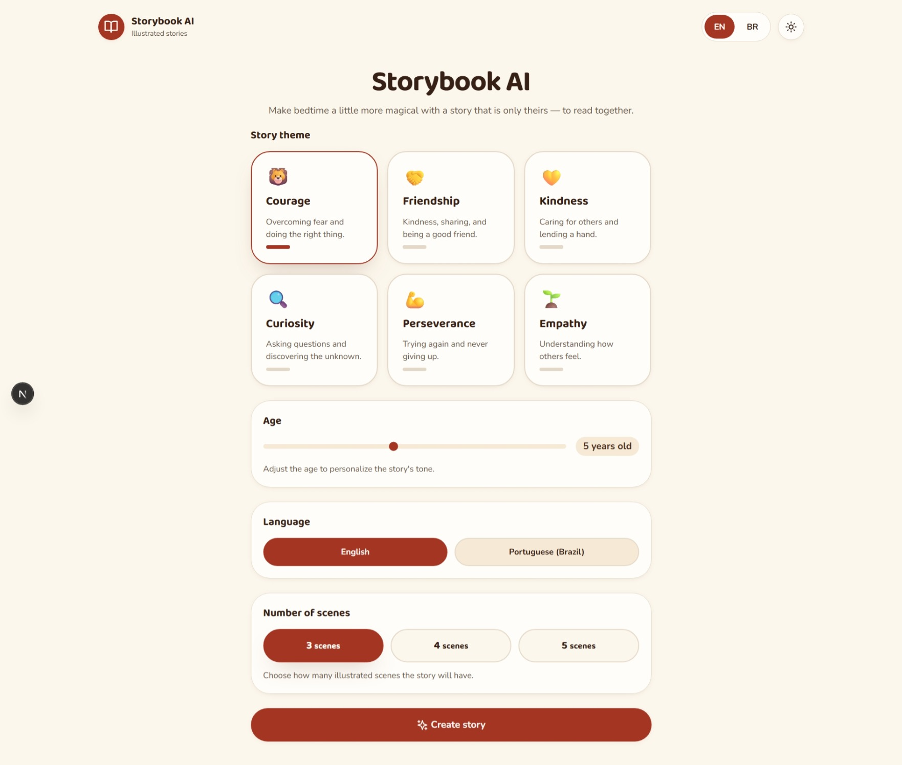
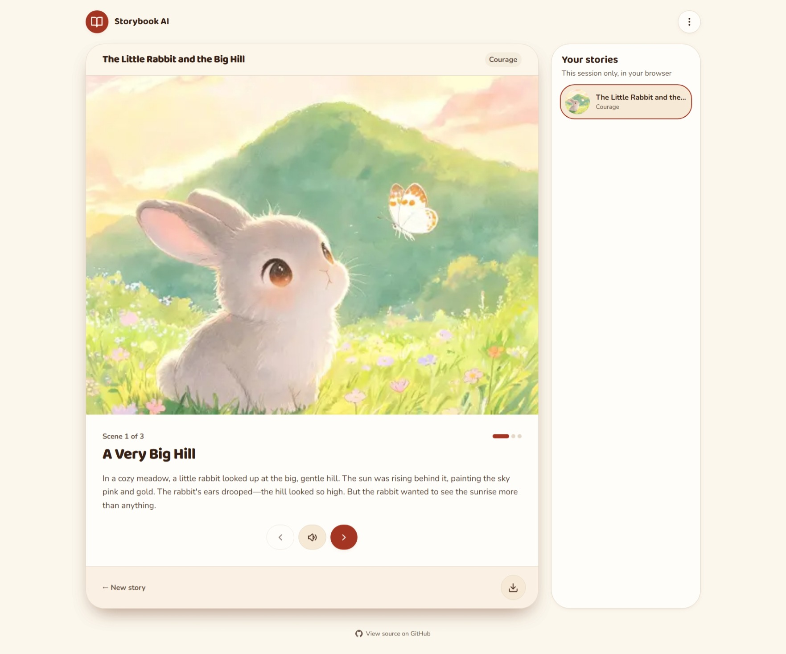

<p align="center">

</p>

# Storybook AI

Personalized children's story generator I created for my daughter. Choose an age
range, language, and theme; the app generates a multi-scene story (3–5 scenes)
with illustrations.

## Overview

- 🧒 **Age bands**: `2-4`, `5-7`, `8-9`.
- 🎭 **Themes**: courage, friendship, kindness, curiosity, perseverance, empathy.
- 🌎 **Languages**: `en` and `pt-BR`.
- 📖 **Scenes** `3–5` with generated illustrations.
- 🔊 **Read-aloud** of the current scene.
- 📄 **PDF export**.
- 🌓 **Dark mode**.
- 🔐 **Optional Google/GitHub login** that gates the real-LLM playground
  (`/form`, `/reader`) — anonymous visitors can still explore via `/demo`.

## Access & demo

- **`/`** — the **login gate**: sign in with Google or GitHub, or click
  **Explore the Demo**.
- **`/demo`** 🧪 — the anonymous playground (mirrors the form): deterministic
  fake stories, zero cookies, no login.
- **`/form` / `/reader`** 🔐 — the authenticated playground: uses the real
  multi-agent LLM pipeline and requires login.

The demo and playground render the **same** story UI; only the generation
backend (fake catalog vs. real LLMs) and the session requirement differ.

## Screenshots

<table>
  <tr>
    <td align="center">
      
      <br>
      <em>The story request form</em>
    </td>
    <td align="center">
      
      <br>
      <em>The story reader</em>
    </td>
  </tr>
</table>

## How story generation works

You pick an age range, a language, and a theme.
The app writes a story with 3–5 scenes — text plus illustrations made for that
age range — all in a single step. From there you can flip between scenes, listen
to each one read aloud, export it as a PDF, or change to dark mode.

**Anonymous by design** — the app works without a child's name or exact age,
and no direct identifier is sent or stored; the only in-memory key is a short-lived,
salted **hash of the connecting IP** used for rate limiting.

## Run locally

### 1. Setup (one-time)

```bash
corepack enable
pnpm install
cp .env.example .env.local
```

Then fill in `.env.local` with your provider **keys** (used only when a model
carries the matching provider prefix) and your **models** (the first segment
of each `*_MODEL` selects the provider):

#### 🔑 Provider keys

| Variable              | Purpose                                                           |
| --------------------- | ----------------------------------------------------------------- |
| `OPENROUTER_API_KEY`  | Used when a model uses the `openrouter/` prefix (any capability)  |
| `OPENCODE_GO_API_KEY` | Used when a model uses the `opencode-go/` prefix (any capability) |

#### 🧠 Models (first segment = provider, unprefixed models are rejected at boot)

Each capability routes **independently**, so every `*_MODEL` can point to a
different provider/model with the fitting capability.

| Variable            | Purpose                                  | Example                                       |
| ------------------- | ---------------------------------------- | --------------------------------------------- |
| `PLANNER_MODEL`     | story outline generation (text, req)     | `opencode-go/deepseek-v4-flash`               |
| `WRITER_MODEL`      | story narrative generation (text, req)   | `opencode-go/deepseek-v4-flash`               |
| `MODERATOR_MODEL`   | safety moderation (text + image prompts) | `opencode-go/deepseek-v4-flash`               |
| `ILLUSTRATOR_MODEL` | illustration generation (WebP, req)      | `openrouter/bytedance-seed/seedream-5-0-lite` |
| `READER_MODEL`      | AI narration voice (TTS, req)            | `openrouter/hexgrad/kokoro-82m`               |

#### ⚙️ Mode

| Variable                   | Default | Purpose                                                  |
| -------------------------- | ------- | -------------------------------------------------------- |
| `STORIES_TEST_MODE`        | unset   | `fake` → deterministic offline dev provider, no AI calls |
| `STORY_FAKE_STEP_DELAY_MS` | `1000`  | per-step fake latency in `fake` mode (0 = fastest)       |
| `AI_NARRATION_ENABLED`     | `false` | enable the AI neural voice (uses `READER_MODEL`)         |

#### ⏱️ Timeouts & retries (all optional)

| Variable              | Default  | Purpose                                      |
| --------------------- | -------- | -------------------------------------------- |
| `MODEL_TIMEOUT_MS`    | `60000`  | per single model/provider call timeout (ms)  |
| `MODEL_MAX_ATTEMPTS`  | `1`      | total attempts per model call (1 = no retry) |
| `PIPELINE_TIMEOUT_MS` | `120000` | end-to-end story generation budget (ms)      |

#### ⏱️ Rate limiting (anonymous, per IP)

| Variable                        | Default | Purpose                                |
| ------------------------------- | ------- | -------------------------------------- |
| `STORY_RATE_LIMIT_MAX_REQUESTS` | `10`    | max story-generation requests / window |
| `STORY_RATE_LIMIT_WINDOW_MS`    | `60000` | rate-limit window for story generation |
| `TTS_RATE_LIMIT_MAX_REQUESTS`   | `30`    | max narration requests / window        |
| `TTS_RATE_LIMIT_WINDOW_MS`      | `60000` | rate-limit window for narration        |

#### 🔐 Authentication (optional — Google / GitHub)

With no `AUTH_*` set, the app runs in **demo-only** mode: `/` shows a login screen
with disabled OAuth buttons and only **Explore the Demo** works (no session, no
cookie). Set `AUTH_SECRET` to enable login; add provider credentials to enable
their buttons.

| Variable                | Purpose                                                        |
| ----------------------- | -------------------------------------------------------------- |
| `AUTH_SECRET`           | required to enable auth (any value; `openssl rand -base64 32`) |
| `AUTH_GOOGLE_ID`        | Google OAuth client id (both id + secret enable the button)    |
| `AUTH_GOOGLE_SECRET`    | Google OAuth client secret                                     |
| `AUTH_GITHUB_ID`        | GitHub OAuth client id (both id + secret enable the button)    |
| `AUTH_GITHUB_SECRET`    | GitHub OAuth client secret                                     |
| `AUTH_URL`              | canonical URL (local dev: `http://localhost:3000`)             |
| `AUTH_TRUST_HOST`       | `true` when not behind a reverse proxy                         |
| `AUTH_ALLOWLIST_EMAILS` | comma-separated email allowlist (optional access control)      |

Sessions are **stateless JWTs** (24 h) in an httpOnly cookie on the playground
path only — the `/demo` path stays cookie-less and the app never stores or logs
any identity.

> Prefer `STORIES_TEST_MODE=fake` (instead of real keys) for a fully offline,
> deterministic dev run — no AI calls are made.

### 2. Run

```bash
pnpm dev
```

Open `http://localhost:3000`.

## Architecture

A story is produced by a **multi-agent pipeline** under
`src/features/story-generation/`. The six agents are typed,
in-memory, and run server-side; each is a focused, independently testable stage:

1. **Moderator** – the pipeline's single safety gate. It calls the provider with
   only the allow-listed inputs (`ageBand`, `locale`, `theme`, `sceneCount`),
   then **moderates** every scene's text and illustration prompt (AI text +
   image), regenerating once on unsafe output (else `unsafe_unrecoverable`).
2. **Planner** – derives the story `Outline` (scene structure + theme-aligned
   purposes) from the approved narrative.
3. **Writer** – materializes the localized `WrittenStory` (title + scenes, with
   illustration prompts) from the approved narrative.
4. **Illustrator** – renders only **approved** prompts to optimized WebP with
   bounded concurrency and whole-set retry, so a story is never partially
   illustrated.
5. **Coordinator** – composes the stages, retries transient failures (bounded,
   env-driven), enforces the ≤120 s latency budget, and assembles + validates
   the final `GeneratedStory`.
6. **Reader** – exposes a scene's text for **on-demand** narration via the
   dedicated `/api/narrate` endpoint (no audio is ever embedded in the story
   payload).

Every scene gets localized `altText` and is validated against the response
schema before it's returned; failures map to typed, localized errors
(400/422/429/502/504). Per-capability model routing: each `*_MODEL` prefix
(`opencode-go/` or `openrouter/`) selects the provider — any provider can serve
text, moderation, image, or TTS.

All AI-vendor calls stay behind a server-only adapter
(`story-generation/server`); raw provider output never reaches the client, and
unsafe, partial, or structurally invalid stories are never delivered.

**Stack**: Next.js 16 + React 19 · TypeScript (strict) · Tailwind · next-intl ·
Zod · sharp · @react-pdf/renderer. AI (server-only): OpenRouter + OpenCode,
routed per capability. Tests: Vitest + Testing Library, Storybook, Playwright.

**Quality gates** are enforced in two layers.

- **Per commit** (fast, enforced by the pre-commit hook):

  | Validation | What it checks              |
  | ---------- | --------------------------- |
  | Lint       | no lint warnings            |
  | Format     | no Prettier drift           |
  | Typecheck  | strict TypeScript, no `any` |

  Lint also enforces a **cyclomatic-complexity gate**: every function must stay at `≤ 10`.

- **Per push/PR to `main`** (CI, run automatically, on top of the
  per-commit gate):

  | Validation       | What it checks                                          |
  | ---------------- | ------------------------------------------------------- |
  | Test coverage    | ≥80% overall; ≥90% safety/validation/orchestration      |
  | Build            | production build compiles                               |
  | Storybook + a11y | every story renders + no accessibility violations       |
  | E2E              | pt-BR & EN journeys, fake provider, no live AI          |
  | Visual           | no unintended screenshot regression                     |
  | Performance      | LCP, route JS, scene navigation, and generation budgets |

  See `package.json` scripts and `.github/workflows/ci.yml`.

## Disclaimer

AI-generated content and caregiver responsibility are covered in the
[Disclaimer](DISCLAIMER.md).
